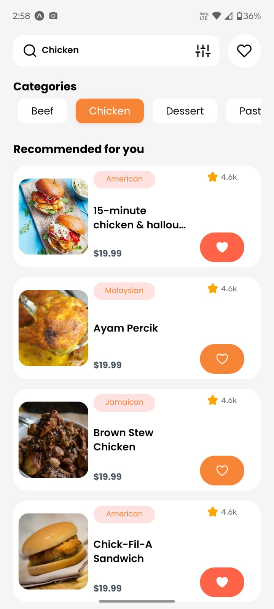
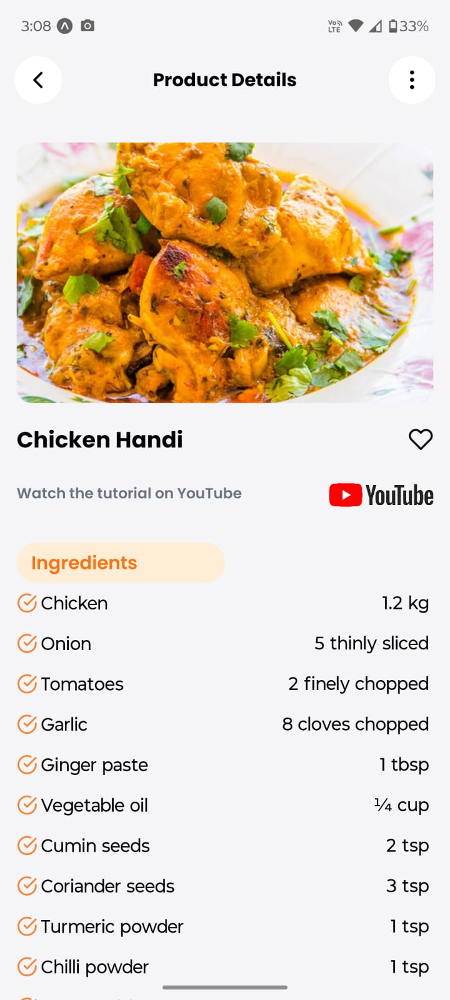
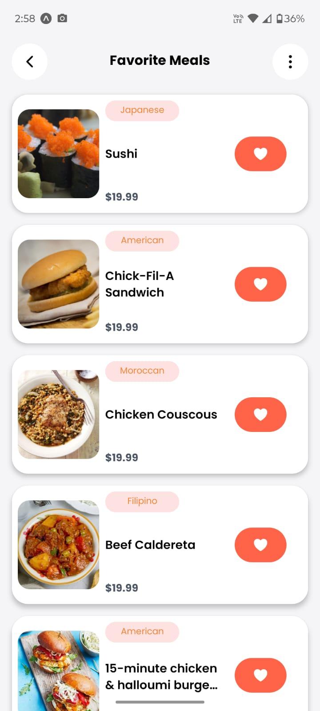

# 🍽️ RecipeApp — Delicious Recipes at Your Fingertips 👋

Welcome to **RecipeApp**, a beautiful and intuitive cross-platform mobile app built with [Expo](https://expo.dev) and React Native. Explore a wide variety of recipes from around the world, save your favorites, and cook with confidence!

---

## 🌟 Features

- **Browse Recipes** by category, region, or ingredient using TheMealDB API.
- **Recipe Details** with images, ingredients, cooking instructions, and more.
- **Favorites**: Mark and unmark recipes you love. Favorites persist locally using AsyncStorage.
- **Smooth UI & UX** with loading indicators, icons, and responsive design.
- **Navigation** powered by Expo Router with file-based routing for easy screen management.
- Works seamlessly on **iOS**, **Android**, and **web** via Expo Go or emulators.

---

## 📱 Screenshots

  
*Browse delicious recipes*

  
*View detailed cooking instructions*

  
*Save and manage your favorite meals*

---

## 🚀 Getting Started


### Prerequisites

- Node.js (v16+ recommended)
- npm or yarn
- Expo CLI installed globally:  
  ```bash
  npm install -g expo-cli
